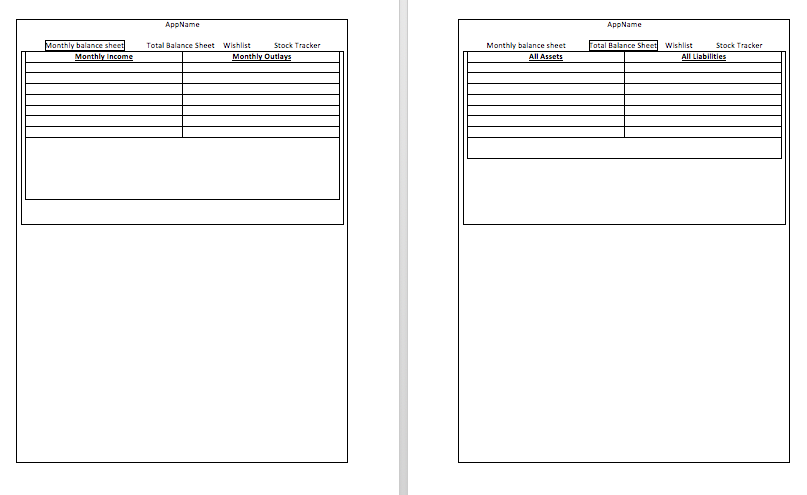

# Tabula Area

## MVP

Tabula Aurea allows the user to track monthly spending as compared to income and provide chart breakdowns, sums, and a result at the bottom  The user can also list all assets and liabilities with the same functionality  Finally, the user can make a list of financial goals and wishes.  On the last page, the user can access APIs that list the current spot prices of gold and silver, as well as a stock quote for any publicly traded company they want to search.

## Technologies, Dependencies
The project is a MERN stack using native CSS.  It will make use of React Router to render all four pages/components on a single page and has the following dependencies: 

- axios
- bcryptjs
- connect-mongo
- dotenv
- ejs
- express
- express-session
- mongoose 
- react
- react-router-dom
- react-chartjs
- request

## Wireframes

This wireframe details the central 2 pages that constitute the app: .

## Data models
This app will consist of a user which has a one-to-many relationship to six simple data models, none of which will relate to one another.

